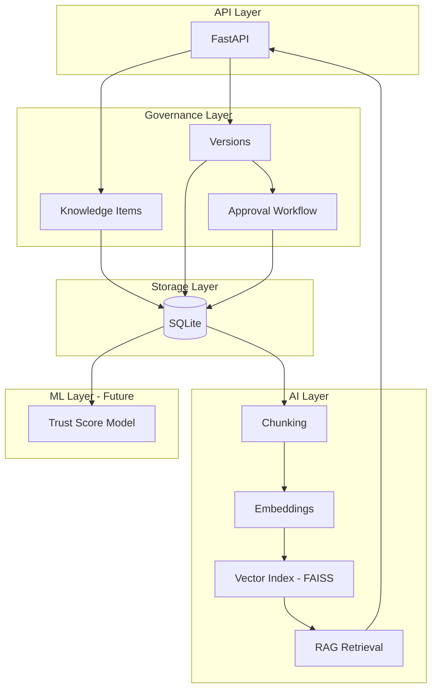

# GovRAG 🏛️📚
### Governed Retrieval-Augmented Generation for Expert Knowledge

GovRAG is a **domain-agnostic AI knowledge platform** that transforms expert content into:

- versioned knowledge  
- approved & governed content  
- AI-queryable trusted sources  
- auditable RAG responses  

This project is designed as a **flagship applied AI + data platform**.

---

# ✨ Why GovRAG?

Traditional RAG retrieves everything.

GovRAG retrieves **only approved and trusted knowledge**.

This enables:

- Industrial AI copilots  
- Operational decision support  
- AI with governance  
- Traceable answers with citations  

---

# 🧠 Core Principles

- Knowledge is versioned  
- Content must be approved  
- AI only uses trusted sources  
- Feedback becomes ML training data  

---

# 🏗️ Layered Architecture


---

## ✅ Trust Score (ML Baseline)

GovRAG logs every `/ask` call and user feedback (`/feedback`) to create a supervised dataset.

A baseline **Logistic Regression** model is trained on simple features:

- question length
- retrieval distance
- whether retrieval happened
- feedback comment length

The API returns:

- `trust_score` (0–1)
- `trust_label` (low/medium/high)

Example:

```json
{
  "answer": "...",
  "trust_score": 0.9996,
  "trust_label": "high",
  "citations": [...]
}
```